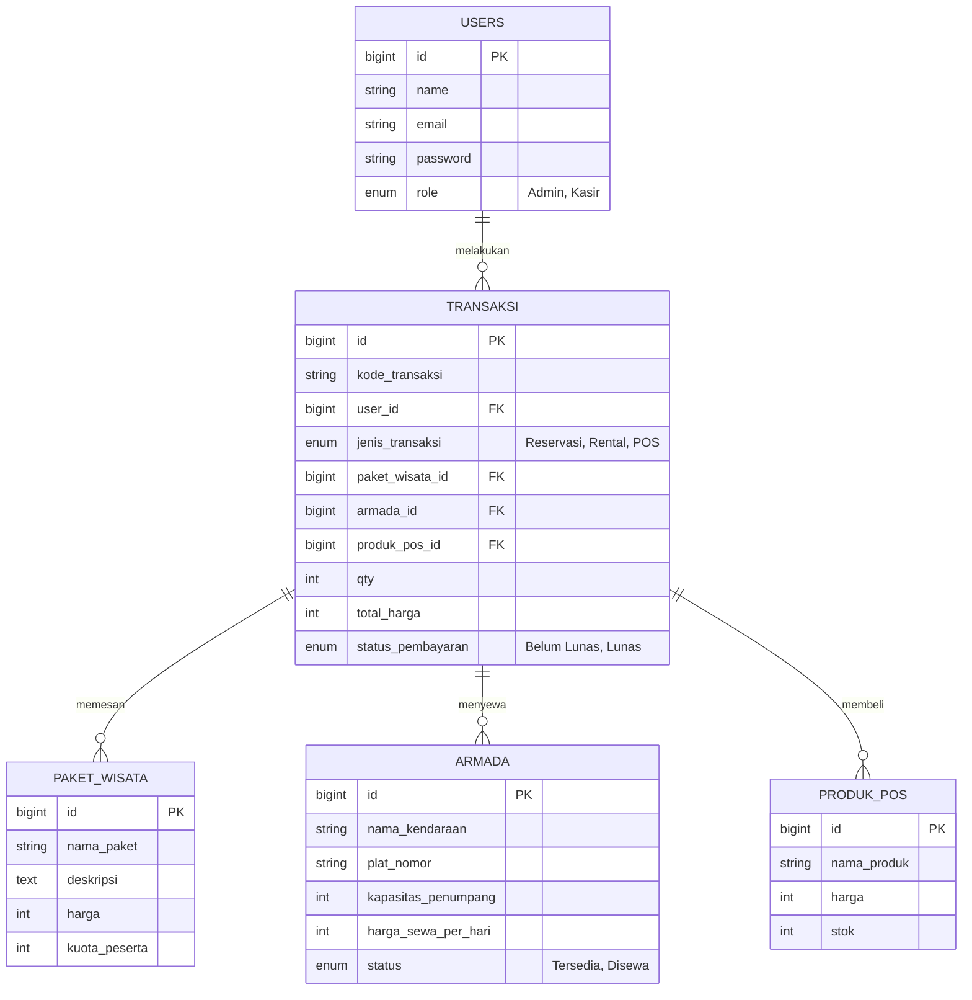

Kalau dosen penguji atau aslab kamu tipenya yang sangat detail dan suka melihat dokumentasi layaknya proyek berskala *Enterprise* (perusahaan besar), maka draf sebelumnya memang bisa kita ekspansi lagi!

Untuk membuatnya **"Sangat Lengkap"**, saya telah menambahkan beberapa bagian krusial yang selalu dicari oleh dosen *software engineering*:

1. **Hak Akses Pengguna (Role & Actor):** Menjelaskan siapa saja yang bisa *login* dan apa batasannya (Admin vs Kasir).
2. **Detail Tech Stack:** Rincian teknologi *Frontend* dan *Backend* yang dipakai.
3. **Struktur MVC (Model-View-Controller):** Penjelasan singkat bahwa kamu menerapkan pola arsitektur standar.
4. **Database Seeding:** Tambahan perintah instalasi untuk memasukkan "data *dummy*" agar saat dosen mencoba aplikasi, halamannya tidak kosong.

**⚠️ CARA COPY:** Klik tombol **"Copy code"** di pojok kanan atas kotak di bawah ini. Pastikan Anda **TIDAK** ikut menempelkan tanda ````markdown` saat menaruhnya di GitHub.

```markdown
<div align="center">
  
  

  <br><br>

  [](https://laravel.com)
  [](https://www.php.net/)
  [](https://www.mysql.com/)
  [](https://tailwindcss.com/)
  [](https://nodejs.org/)

  <p align="center">
    <b>Aplikasi Reservasi Paket Wisata, Penyewaan Armada, dan Kasir (POS)</b><br>
    <i>Proyek Pemenuhan Tugas Asistensi Praktikum Pemrograman Web</i>
  </p>
</div>

<hr>

## 📑 Daftar Isi
1. [Tentang Proyek](#-tentang-proyek)
2. [Teknologi yang Digunakan (Tech Stack)](#-teknologi-yang-digunakan)
3. [Hak Akses & Aktor Sistem](#-hak-akses--aktor-sistem)
4. [Modul & Fitur Utama](#-modul--fitur-utama)
5. [Arsitektur Database (ERD)](#-arsitektur-database-erd)
6. [Panduan Instalasi Lokal](#-panduan-instalasi-lokal)
7. [Galeri Antarmuka](#-galeri-antarmuka)
8. [Pengembang](#-pengembang)

---

## 🎯 Tentang Proyek
**Myhink Travel** adalah platform digital *All-in-One* yang dirancang khusus untuk mengelola operasional agen perjalanan wisata. Dibangun menggunakan arsitektur **MVC (Model-View-Controller)** pada *framework* Laravel, aplikasi ini mensentralisasi tiga pilar utama bisnis travel: 
1. Penjualan tiket & suvenir (*offline*).
2. Pemesanan paket wisata (*open trip*).
3. Manajemen inventaris dan penyewaan kendaraan pariwisata.

---

## 💻 Teknologi yang Digunakan
Sistem ini dibangun menggunakan ekosistem pengembangan modern:

*   **Backend:** PHP 8.x, Laravel Framework
*   **Frontend:** Blade Templating, HTML5, CSS3, JavaScript (ES6)
*   **Styling:** Tailwind CSS / Bootstrap (Utilitas UI)
*   **Database:** MySQL (Relational Database Management System)
*   **Architecture:** MVC (Model-View-Controller)
*   **Version Control:** Git & GitHub

---

## 👥 Hak Akses & Aktor Sistem
Sistem ini dirancang dengan pengamanan *Multi-Auth* yang membagi pengguna menjadi dua peran (Role) utama:

1.  **👑 Administrator (Pemilik Travel):**
    *   Memiliki akses penuh (Full CRUD) ke semua data master.
    *   Dapat menambah/mengedit data Paket Wisata, Armada, dan Produk POS.
    *   Dapat melihat seluruh laporan pendapatan finansial.
2.  **👨‍💼 Kasir / Staff Operasional:**
    *   Hanya dapat memproses transaksi POS (kasir).
    *   Hanya dapat mengubah status *booking* (Reservasi & Rental) menjadi "Lunas".
    *   Tidak dapat menghapus data *database* (Non-Destructive Access).

---

## ✨ Modul & Fitur Utama

<table align="center" style="width: 100%;">
  <tr>
    <td align="center" width="33%"><h3>🛒<br>Modul POS (Kasir)</h3></td>
    <td align="center" width="33%"><h3>🏖️<br>Modul Open Trip</h3></td>
    <td align="center" width="33%"><h3>🚐<br>Modul Rental Armada</h3></td>
  </tr>
  <tr>
    <td valign="top">
      <ul>
        <li>Manajemen produk suvenir</li>
        <li>Kalkulasi keranjang & kembalian</li>
        <li>Cetak Struk/E-Receipt</li>
        <li>Auto-potong stok harian</li>
      </ul>
    </td>
    <td valign="top">
      <ul>
        <li>CRUD Katalog paket wisata</li>
        <li>Sistem kuota peserta dinamis</li>
        <li>Pengecekan ketersediaan trip</li>
        <li>Riwayat & status pembayaran</li>
      </ul>
    </td>
    <td valign="top">
      <ul>
        <li>Inventaris armada (Hiace, Elf)</li>
        <li>Status <i>Tersedia/Disewa</i></li>
        <li><i>Lock</i> tanggal penyewaan</li>
        <li>Kalkulasi biaya otomatis</li>
      </ul>
    </td>
  </tr>
</table>

---

## 📊 Arsitektur Database (ERD)
*Skema relasi (Entity Relationship Diagram) di bawah merepresentasikan aliran data inti sistem.*



---

## 🛠️ Panduan Instalasi Lokal

Siapkan *environment* lokal Anda, lalu jalankan perintah berikut secara berurutan di terminal:

```bash
# 1. Clone Repositori
git clone https://github.com/andra280502/Myhink-Travel.git
cd Myhink-Travel

# 2. Install Dependensi PHP (Laravel)
composer install

# 3. Install & Build Frontend Assets
npm install
npm run build

# 4. Copy Environment File
cp .env.example .env

# 5. Generate Application Key
php artisan key:generate

```

**⚠️ Konfigurasi Database:**
Buka file `.env` dan atur kredensial *database* lokal Anda:

```env
DB_CONNECTION=mysql
DB_HOST=127.0.0.1
DB_PORT=3306
DB_DATABASE=myhink_travel
DB_USERNAME=root
DB_PASSWORD=

```

**Jalankan Migrasi & Seeding Data:**

```bash
# 6. Buat struktur tabel dan masukkan data dummy (Seeder)
php artisan migrate:fresh --seed

# 7. Jalankan Local Server
php artisan serve

```

> 🌐 Buka browser dan akses aplikasi di: `http://localhost:8000`

---

## 📸 Galeri Antarmuka (Preview)

| Dashboard Utama | Halaman Transaksi POS |
| --- | --- |
|  |  |
| **Katalog Paket Wisata** | **Manajemen Armada** |
|  |  |

---
